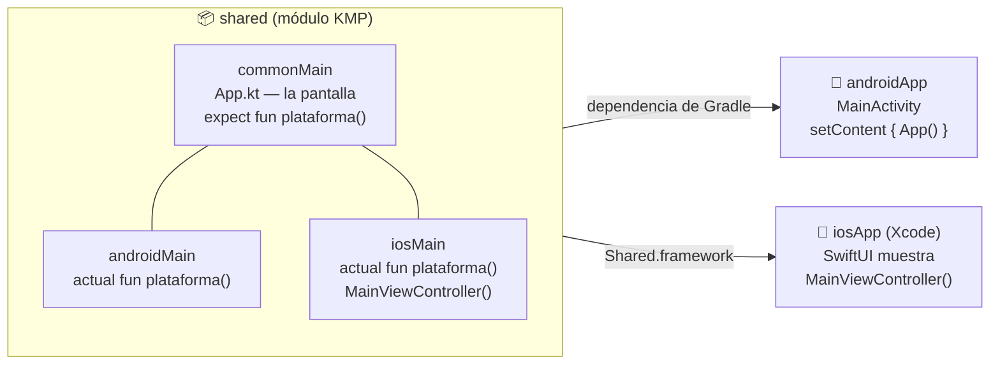
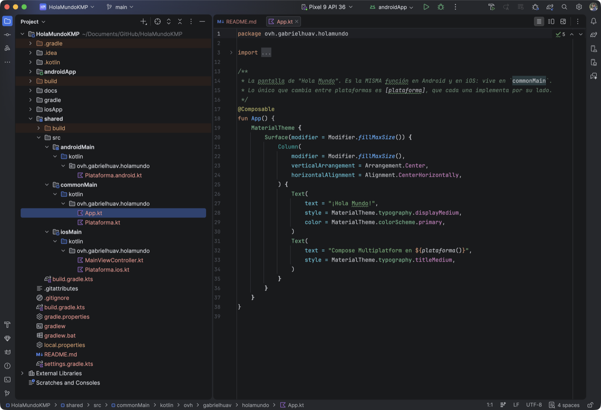
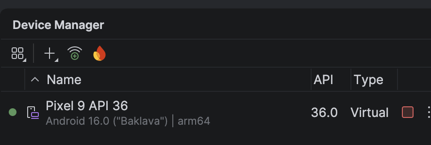
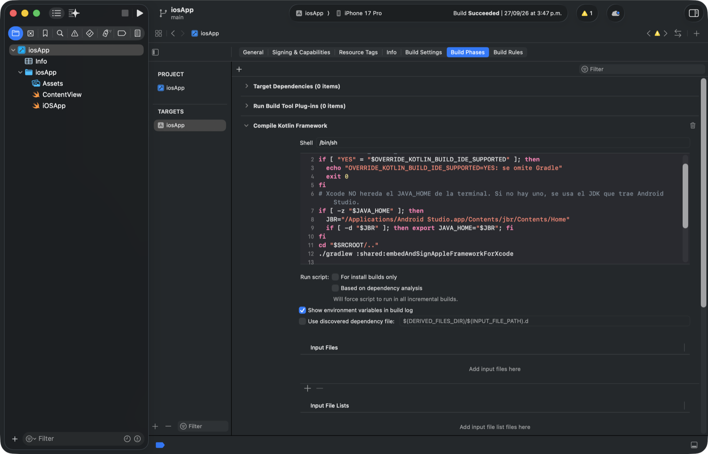
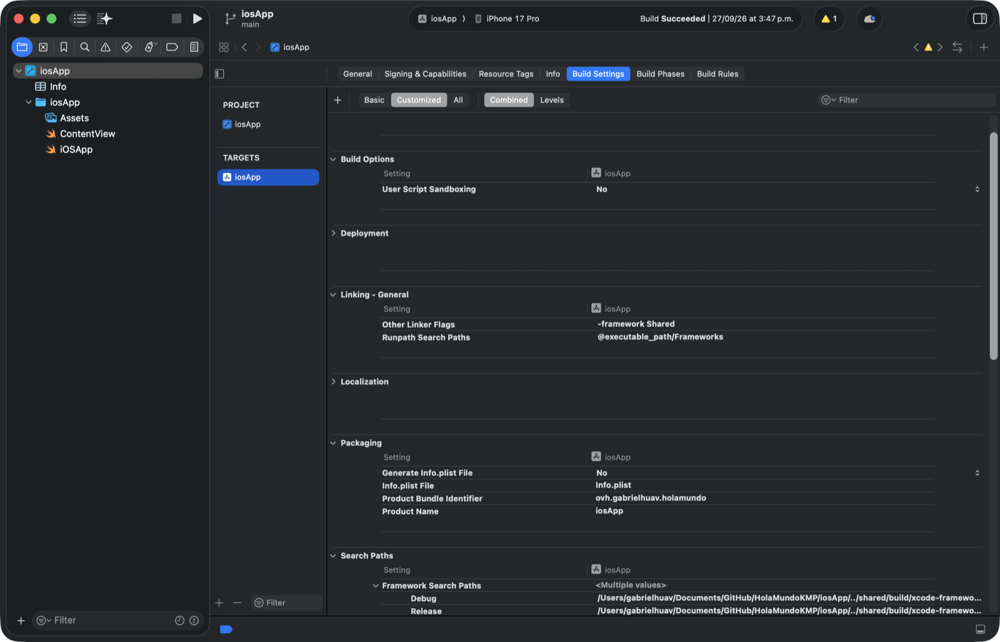
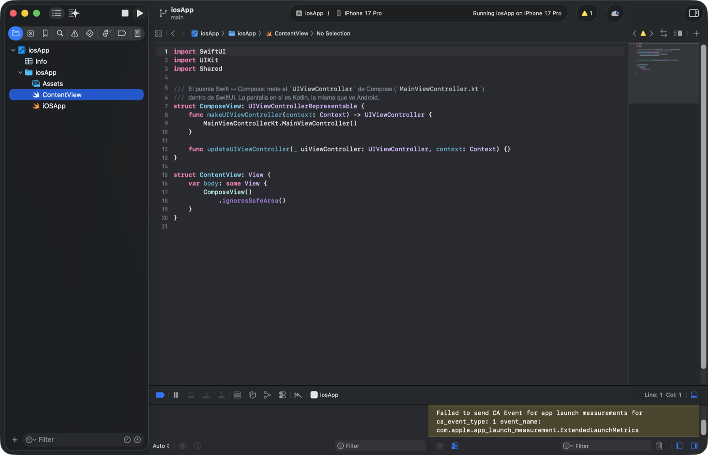

# HolaMundoKMP — tu primera app con Kotlin Multiplatform

🇬🇧 [English](README.md) · 🇪🇸 **Español**

Un **"¡Hola Mundo!" escrito una sola vez en Kotlin** que corre en **Android** y en **iOS**, con la
interfaz hecha en **Compose Multiplatform** (el mismo Jetpack Compose de Android, pero también para
iPhone).

Este README es un **tutorial paso a paso para principiantes**: explica cada archivo del proyecto en
el orden en que lo escribirías tú partiendo de una carpeta vacía. **Primero se monta y se ejecuta en
Android**, y **después se le añade iOS**.

| Android 16 (emulador Pixel 9) | iOS 26.5 (simulador iPhone 17 Pro) |
|:---:|:---:|
|  |  |

Las dos pantallas salen de **la misma función Kotlin** (`App()`). Lo único que cambia es la segunda
línea, que dice en qué sistema está corriendo: esa parte la escribe cada plataforma por su lado.

---

## Índice

- [Conceptos en 3 minutos](#conceptos-en-3-minutos)
- [Qué necesitas instalar](#qué-necesitas-instalar)
- [Si solo quieres correrlo](#si-solo-quieres-correrlo)
- **[Parte 1 — Android](#parte-1--android)**
  - [1.1 La carpeta y el Gradle Wrapper](#11-la-carpeta-y-el-gradle-wrapper)
  - [1.2 `settings.gradle.kts`: qué módulos hay](#12-settingsgradlekts-qué-módulos-hay)
  - [1.3 `gradle/libs.versions.toml`: las versiones en un solo sitio](#13-gradlelibsversionstoml-las-versiones-en-un-solo-sitio)
  - [1.4 `build.gradle.kts` raíz y `gradle.properties`](#14-buildgradlekts-raíz-y-gradleproperties)
  - [1.5 El módulo `shared` (solo Android por ahora)](#15-el-módulo-shared-solo-android-por-ahora)
  - [1.6 La pantalla compartida: `App.kt`](#16-la-pantalla-compartida-appkt)
  - [1.7 `expect` / `actual`: lo que cambia por plataforma](#17-expect--actual-lo-que-cambia-por-plataforma)
  - [1.8 El módulo `androidApp`](#18-el-módulo-androidapp)
  - [1.9 Abrirlo en Android Studio](#19-abrirlo-en-android-studio)
  - [1.10 Crear el emulador](#110-crear-el-emulador)
  - [1.11 ¡Ejecutar en Android!](#111-ejecutar-en-android)
- **[Parte 2 — iOS (solo en Mac)](#parte-2--ios-solo-en-mac)**
  - [2.1 Antes de empezar](#21-antes-de-empezar)
  - [2.2 Añadir los targets de iOS a `shared`](#22-añadir-los-targets-de-ios-a-shared)
  - [2.3 El código de `iosMain`](#23-el-código-de-iosmain)
  - [2.4 Comprobar que el Kotlin de iOS compila](#24-comprobar-que-el-kotlin-de-ios-compila)
  - [2.5 El proyecto Xcode (`iosApp/`)](#25-el-proyecto-xcode-iosapp)
  - [2.6 ¡Ejecutar en el simulador de iOS!](#26-ejecutar-en-el-simulador-de-ios)
  - [2.7 En un iPhone de verdad](#27-en-un-iphone-de-verdad)
- [Parte 3 — ¿Y ahora qué?](#parte-3--y-ahora-qué)
- **[Parte 4 — Usar este repo como base para tu app](#parte-4--usar-este-repo-como-base-para-tu-app)**
- [Problemas frecuentes](#problemas-frecuentes)
- [Versiones usadas](#versiones-usadas)

---

## Conceptos en 3 minutos

**Kotlin Multiplatform (KMP)** te deja escribir código Kotlin **una vez** y compilarlo para varias
plataformas: a bytecode de la JVM para Android y a código nativo (Kotlin/Native) para iOS.

**Compose Multiplatform (CMP)** va un paso más allá: además de la lógica, comparte la **interfaz**.
Si ya sabes Jetpack Compose, ya sabes CMP: `@Composable`, `Column`, `Text`, `MaterialTheme`… son los
mismos, con los mismos `import androidx.compose.*`.

El proyecto tiene **tres piezas**:



- **`shared`** es donde vive casi todo. Dentro tiene *source sets* (carpetas de código):
  - `commonMain`: código que compila para **todas** las plataformas. Aquí no puedes usar nada
    exclusivo de Android (`android.*`) ni de iOS (`platform.UIKit.*`).
  - `androidMain`: código que **solo** se compila para Android. Aquí sí puedes usar `android.*`.
  - `iosMain`: código que **solo** se compila para iOS. Aquí puedes usar las APIs de Apple
    (`platform.UIKit.*`, `platform.Foundation.*`…).
- **`androidApp`** es una app Android normal y corriente. Su única tarea es abrir una `Activity` y
  pintar la pantalla de `shared`.
- **`iosApp`** es un proyecto Xcode normal y corriente (SwiftUI). Su única tarea es abrir una
  ventana y meter dentro la pantalla de `shared`.

---

## Qué necesitas instalar

| Para… | Necesitas | Sistema |
|---|---|---|
| Android | **Android Studio** (trae el SDK de Android, el emulador y un JDK) | Windows, Mac o Linux |
| iOS | Lo de arriba **+ Xcode** (desde la App Store) | **Solo Mac** |

> 💡 **No hace falta instalar Java aparte.** Android Studio trae su propio JDK (se llama *JBR*). Si
> vas a usar Gradle desde la terminal, dile dónde está:
>
> - **Mac:** `export JAVA_HOME="/Applications/Android Studio.app/Contents/jbr/Contents/Home"`
> - **Windows (PowerShell):** `$env:JAVA_HOME = "C:\Program Files\Android\Android Studio\jbr"`
>
> Dentro de Android Studio no hace falta nada: ya lo usa solo.

> 💡 **Mac con chip Apple (M1, M2, M3…).** La parte de iOS está pensada para Mac con Apple Silicon.
> En un Mac Intel el simulador de iOS no funcionaría (ver [Problemas frecuentes](#problemas-frecuentes)).

---

## Si solo quieres correrlo

**1. Clona el repo.** Con **GitHub Desktop**: *File → Clone repository…* → pestaña *URL* → pega la
dirección del repo → elige carpeta → *Clone*. O desde la terminal:

```bash
git clone <URL-de-este-repo>
```

**2. Android (Windows, Mac o Linux):** abre la carpeta `HolaMundoKMP` en Android Studio → espera a
que termine el *Gradle sync* → elige `androidApp` y un emulador arriba → ▶. Detalle en
[1.9](#19-abrirlo-en-android-studio) a [1.11](#111-ejecutar-en-android).

**3. iOS (solo Mac):** abre `iosApp/iosApp.xcodeproj` en Xcode → elige un simulador de iPhone → ▶.
Detalle en [2.6](#26-ejecutar-en-el-simulador-de-ios). Para tu propio iPhone, mira
[2.7](#27-en-un-iphone-de-verdad).

Si lo que quieres es **aprender a montarlo tú**, sigue leyendo.

---

# Parte 1 — Android

Al terminar esta parte tendrás el "¡Hola Mundo!" corriendo en el emulador de Android. Todo lo que
se hace aquí funciona **igual en Windows, Mac y Linux**.

## 1.1 La carpeta y el Gradle Wrapper

Crea una carpeta vacía, por ejemplo `HolaMundoKMP`. Todo lo demás va dentro.

**Gradle** es la herramienta que compila el proyecto. El **Gradle Wrapper** son 4 archivos que
descargan y usan siempre la **misma versión** de Gradle, para que el proyecto compile igual en
cualquier máquina sin instalar Gradle:

```
HolaMundoKMP/
├── gradlew                              ← script para Mac/Linux
├── gradlew.bat                          ← script para Windows
└── gradle/wrapper/
    ├── gradle-wrapper.jar
    └── gradle-wrapper.properties        ← dice QUÉ versión de Gradle usar
```

La forma más fácil de conseguirlos es **copiarlos de cualquier proyecto Android** que ya tengas (o de
este repo). Si tienes Gradle instalado, también puedes generarlos con
`gradle wrapper --gradle-version 9.5.0`.

Lo importante está en `gradle/wrapper/gradle-wrapper.properties`:

```properties
distributionUrl=https\://services.gradle.org/distributions/gradle-9.5.0-bin.zip
```

## 1.2 `settings.gradle.kts`: qué módulos hay

Es lo primero que lee Gradle. Dice **cómo se llama el proyecto**, **de dónde se descargan** los
plugins y las librerías, y **qué módulos** tiene.

```kotlin
rootProject.name = "HolaMundoKMP"

pluginManagement {
    repositories {
        google {
            content {
                includeGroupByRegex("com\\.android.*")
                includeGroupByRegex("com\\.google.*")
                includeGroupByRegex("androidx.*")
            }
        }
        mavenCentral()
        gradlePluginPortal()
    }
}

plugins {
    // Descarga sola el JDK que pida un toolchain si en la máquina no lo hay.
    id("org.gradle.toolchains.foojay-resolver-convention") version "1.0.0"
}

dependencyResolutionManagement {
    repositoriesMode.set(RepositoriesMode.FAIL_ON_PROJECT_REPOS)
    repositories {
        google()        // librerías de Google/AndroidX
        mavenCentral()  // casi todo lo demás (Kotlin, Compose Multiplatform…)
    }
}

include(":shared")
include(":androidApp")
```

Cada `include(":x")` corresponde a una carpeta `x/` con su propio `build.gradle.kts`.

## 1.3 `gradle/libs.versions.toml`: las versiones en un solo sitio

Es el **catálogo de versiones**. En vez de escribir `"2.3.21"` en cinco archivos distintos, se
escribe una vez aquí y los `build.gradle.kts` lo usan como `libs.plugins.kotlin.multiplatform`,
`libs.androidx.activity.compose`, etc. (Los guiones del `.toml` se convierten en puntos.)

```toml
[versions]
agp = "9.3.0"
kotlin = "2.3.21"
composeMultiplatform = "1.11.1"
composeMaterial3 = "1.9.0"      # Material 3 lleva su propia numeración
activityCompose = "1.12.4"
android-compileSdk = "36"
android-targetSdk = "36"
android-minSdk = "24"

[libraries]
androidx-activity-compose = { module = "androidx.activity:activity-compose", version.ref = "activityCompose" }
compose-runtime = { module = "org.jetbrains.compose.runtime:runtime", version.ref = "composeMultiplatform" }
compose-foundation = { module = "org.jetbrains.compose.foundation:foundation", version.ref = "composeMultiplatform" }
compose-ui = { module = "org.jetbrains.compose.ui:ui", version.ref = "composeMultiplatform" }
compose-material3 = { module = "org.jetbrains.compose.material3:material3", version.ref = "composeMaterial3" }

[plugins]
android-application = { id = "com.android.application", version.ref = "agp" }
android-kmp-library = { id = "com.android.kotlin.multiplatform.library", version.ref = "agp" }
kotlin-multiplatform = { id = "org.jetbrains.kotlin.multiplatform", version.ref = "kotlin" }
compose-multiplatform = { id = "org.jetbrains.compose", version.ref = "composeMultiplatform" }
kotlin-compose = { id = "org.jetbrains.kotlin.plugin.compose", version.ref = "kotlin" }
```

Qué es cada plugin:

| Plugin | Para qué sirve |
|---|---|
| `com.android.application` | Convierte un módulo en una **app Android** (genera el APK). |
| `com.android.kotlin.multiplatform.library` | Añade el **target Android** a un módulo KMP. |
| `org.jetbrains.kotlin.multiplatform` | Convierte un módulo en **KMP** (varios targets, source sets). |
| `org.jetbrains.compose` | Aporta las **librerías** de Compose Multiplatform (con versión para iOS). |
| `org.jetbrains.kotlin.plugin.compose` | El **compilador** de Compose: sin él, `@Composable` no compila. |

> ⚠️ **Las versiones van en pareja.** El plugin `kotlin-compose` usa la misma versión que Kotlin, y
> cada Compose Multiplatform exige un Kotlin mínimo. Si subes una, revisa las otras.

> 💡 En tutoriales antiguos verás `implementation(compose.runtime)`, `compose.material3`, etc. Esos
> atajos del plugin **están deprecados** (Gradle avisa: *"Specify dependency directly"*); por eso aquí
> las librerías de Compose se declaran en el catálogo como cualquier otra.

## 1.4 `build.gradle.kts` raíz y `gradle.properties`

El `build.gradle.kts` de la raíz solo **declara** los plugins (`apply false` = "tenlos a mano, pero
no los apliques aquí"). Así todos los módulos usan la misma versión:

```kotlin
plugins {
    alias(libs.plugins.android.application) apply false
    alias(libs.plugins.android.kmp.library) apply false
    alias(libs.plugins.kotlin.multiplatform) apply false
    alias(libs.plugins.compose.multiplatform) apply false
    alias(libs.plugins.kotlin.compose) apply false
}
```

`gradle.properties` son ajustes de Gradle:

```properties
org.gradle.jvmargs=-Xmx4096m -Dfile.encoding=UTF-8   # 4 GB de memoria para Gradle
org.gradle.caching=true                               # reutiliza resultados de compilaciones anteriores

kotlin.code.style=official

android.useAndroidX=true
android.nonTransitiveRClass=true
```

> 💡 También verás `gradle/gradle-daemon-jvm.properties`. **No se escribe a mano**: lo genera Android
> Studio y dice con qué JDK arranca Gradle (aquí, el **25**, el mismo que trae Android Studio 2026.x).
> Si una máquina no lo tiene, Gradle lo descarga solo la primera vez.

## 1.5 El módulo `shared` (solo Android por ahora)

Crea la carpeta `shared/` con este `shared/build.gradle.kts`. **De momento solo tiene el target
Android**; iOS se añade en la [Parte 2](#22-añadir-los-targets-de-ios-a-shared).

```kotlin
import org.jetbrains.kotlin.gradle.dsl.JvmTarget

plugins {
    alias(libs.plugins.kotlin.multiplatform)
    alias(libs.plugins.android.kmp.library)
    alias(libs.plugins.compose.multiplatform)
    alias(libs.plugins.kotlin.compose)
}

kotlin {
    android {
        namespace = "ovh.gabrielhuav.holamundo.shared"
        compileSdk = libs.versions.android.compileSdk.get().toInt()
        minSdk = libs.versions.android.minSdk.get().toInt()

        compilerOptions {
            jvmTarget.set(JvmTarget.JVM_11)
        }
    }

    // (Aquí irán los targets de iOS en la Parte 2)

    sourceSets {
        commonMain.dependencies {
            implementation(libs.compose.runtime)
            implementation(libs.compose.foundation)
            implementation(libs.compose.ui)
            implementation(libs.compose.material3)
        }
    }
}
```

Fíjate en que las dependencias de Compose van en **`commonMain`**: así las puede usar el código
compartido. En Android, el plugin las cambia automáticamente por las `androidx.compose.*` de toda
la vida, así que la app de Android usa el Compose de siempre.

Y crea la estructura de carpetas del código (el paquete puede ser el que quieras):

```
shared/src/
├── commonMain/kotlin/ovh/gabrielhuav/holamundo/
│   ├── App.kt
│   └── Plataforma.kt
└── androidMain/kotlin/ovh/gabrielhuav/holamundo/
    └── Plataforma.android.kt
```

## 1.6 La pantalla compartida: `App.kt`

`shared/src/commonMain/kotlin/ovh/gabrielhuav/holamundo/App.kt`. Es Compose normal y corriente:

```kotlin
package ovh.gabrielhuav.holamundo

import androidx.compose.foundation.layout.Arrangement
import androidx.compose.foundation.layout.Column
import androidx.compose.foundation.layout.fillMaxSize
import androidx.compose.material3.MaterialTheme
import androidx.compose.material3.Surface
import androidx.compose.material3.Text
import androidx.compose.runtime.Composable
import androidx.compose.ui.Alignment
import androidx.compose.ui.Modifier

@Composable
fun App() {
    MaterialTheme {                                   // colores y tipografía de Material 3
        Surface(modifier = Modifier.fillMaxSize()) {  // fondo que ocupa toda la pantalla
            Column(                                   // apila los hijos en vertical…
                modifier = Modifier.fillMaxSize(),
                verticalArrangement = Arrangement.Center,           // …centrados en vertical
                horizontalAlignment = Alignment.CenterHorizontally, // …y en horizontal
            ) {
                Text(
                    text = "¡Hola Mundo!",
                    style = MaterialTheme.typography.displayMedium,
                    color = MaterialTheme.colorScheme.primary,
                )
                Text(
                    text = "Compose Multiplatform en ${plataforma()}",
                    style = MaterialTheme.typography.titleMedium,
                )
            }
        }
    }
}
```

Esta función es la que verán **las dos** plataformas.

## 1.7 `expect` / `actual`: lo que cambia por plataforma

`App()` quiere mostrar "Android 16" o "iOS 26.5". Pero preguntar la versión del sistema **no se
puede hacer igual** en las dos: en Android es `Build.VERSION.RELEASE` y en iOS es `UIDevice`. Y en
`commonMain` no se puede usar ninguna de las dos.

La solución de KMP es **`expect` / `actual`**:

- En `commonMain` **declaras** la función con `expect` (sin cuerpo): "esto existirá".
- En cada plataforma la **implementas** con `actual`.

`shared/src/commonMain/kotlin/ovh/gabrielhuav/holamundo/Plataforma.kt`:

```kotlin
package ovh.gabrielhuav.holamundo

/** Nombre y versión del sistema, p. ej. "Android 16" o "iOS 26.5". Cada plataforma da su `actual`. */
expect fun plataforma(): String
```

`shared/src/androidMain/kotlin/ovh/gabrielhuav/holamundo/Plataforma.android.kt`:

```kotlin
package ovh.gabrielhuav.holamundo

import android.os.Build

actual fun plataforma(): String = "Android ${Build.VERSION.RELEASE}"
```

> 💡 El `expect` y los `actual` tienen que estar en el **mismo paquete** y con la **misma firma**.
> Si a una plataforma le falta su `actual`, el proyecto no compila y el error te dice cuál falta.

## 1.8 El módulo `androidApp`

Es la app Android que se instala en el teléfono. Crea `androidApp/build.gradle.kts`:

```kotlin
import org.jetbrains.kotlin.gradle.dsl.JvmTarget

plugins {
    // AGP 9 trae Kotlin integrado: NO se aplica `org.jetbrains.kotlin.android`.
    alias(libs.plugins.android.application)
    alias(libs.plugins.kotlin.compose)
}

android {
    namespace = "ovh.gabrielhuav.holamundo"
    compileSdk = libs.versions.android.compileSdk.get().toInt()

    defaultConfig {
        applicationId = "ovh.gabrielhuav.holamundo"   // el identificador único de la app
        minSdk = libs.versions.android.minSdk.get().toInt()
        targetSdk = libs.versions.android.targetSdk.get().toInt()
        versionCode = 1
        versionName = "1.0"
    }

    compileOptions {
        sourceCompatibility = JavaVersion.VERSION_11
        targetCompatibility = JavaVersion.VERSION_11
    }

    buildFeatures {
        compose = true
    }
}

kotlin {
    compilerOptions {
        jvmTarget.set(JvmTarget.JVM_11)
    }
}

dependencies {
    implementation(project(":shared"))               // ← aquí se engancha el código compartido
    implementation(libs.androidx.activity.compose)   // aporta setContent { }
}
```

`androidApp/src/main/AndroidManifest.xml` — declara la `Activity` que se abre al tocar el icono:

```xml
<?xml version="1.0" encoding="utf-8"?>
<manifest xmlns:android="http://schemas.android.com/apk/res/android">

    <application
        android:allowBackup="true"
        android:label="Hola Mundo KMP"
        android:supportsRtl="true"
        android:theme="@android:style/Theme.Material.Light.NoActionBar">
        <activity
            android:name=".MainActivity"
            android:exported="true">
            <intent-filter>
                <action android:name="android.intent.action.MAIN" />
                <category android:name="android.intent.category.LAUNCHER" />
            </intent-filter>
        </activity>
    </application>

</manifest>
```

`androidApp/src/main/kotlin/ovh/gabrielhuav/holamundo/MainActivity.kt` — **todo lo que hace Android
es llamar a `App()`**:

```kotlin
package ovh.gabrielhuav.holamundo

import android.os.Bundle
import androidx.activity.ComponentActivity
import androidx.activity.compose.setContent
import androidx.activity.enableEdgeToEdge

class MainActivity : ComponentActivity() {
    override fun onCreate(savedInstanceState: Bundle?) {
        enableEdgeToEdge()
        super.onCreate(savedInstanceState)
        setContent { App() }   // la pantalla de `shared`
    }
}
```

## 1.9 Abrirlo en Android Studio

1. Android Studio → **File → Open…** → elige la carpeta **`HolaMundoKMP`** (la raíz, no `androidApp`).
2. Si pregunta **"Trust and Open Project?"**, pulsa **Trust Project** (es tu propio proyecto).
3. Abajo verás **Gradle sync** trabajando. La primera vez descarga Gradle, los plugins y las
   librerías: puede tardar **varios minutos** (aquí tardó 3 min). Espera a que termine sin errores.
4. Android Studio crea solo un archivo `local.properties` con la ruta de tu SDK de Android. Es
   personal de cada máquina y **no se sube a git** (ya está en `.gitignore`).
5. En Mac, si el proyecto está en `Documents`, `Desktop` o `Downloads`, Android Studio avisa
   *"Project in Protected Folder"*. Es solo una advertencia: el proyecto compila igual (ver
   [Problemas frecuentes](#problemas-frecuentes)).

Para ver la estructura como en este tutorial, en el panel de la izquierda cambia la vista de
*Android* a **Project**. Así queda el proyecto, con los tres *source sets* de `shared` y `App.kt`
abierto; arriba a la derecha, el emulador (`Pixel 9 API 36`) y la configuración `androidApp`:



## 1.10 Crear el emulador

Si ya tienes un emulador, sáltate este paso: **con uno basta** para todos tus proyectos.

1. **Tools → Device Manager** (o el icono del teléfono en la barra derecha).
2. Botón **+ → Create Virtual Device**.
3. Elige un teléfono, por ejemplo **Pixel 9**, y **Next**.
4. Elige la imagen del sistema **API 36 ("Baklava", Android 16)**. Si tiene una flecha de descarga ⬇,
   púlsala (son ~2 GB). Qué variante:
   - PC con Windows/Linux (Intel o AMD) → la **x86_64**.
   - Mac con chip Apple → la **arm64-v8a**.
5. **Finish**. Te queda así (el punto verde indica que está encendido):



> 🧹 **¿Emuladores repetidos?** En el Device Manager, en el menú **⋮** de cada uno está **Delete**.
> Cada emulador ocupa varios GB en disco, así que conviene no acumularlos.

## 1.11 ¡Ejecutar en Android!

En la barra de arriba de Android Studio elige la configuración **`androidApp`** y tu emulador, y
pulsa **▶ Run**. El emulador arranca (la primera vez tarda un poco) y aparece:


Lo mismo desde la terminal, con el emulador ya abierto:

```bash
./gradlew :androidApp:installDebug
```

(En Windows: `gradlew.bat :androidApp:installDebug`.) Eso compila, instala la app en el emulador y
después la abres desde el cajón de apps ("Hola Mundo KMP").

> 💡 Con solo el target Android, Gradle muestra el aviso **`⚠️ Unused Kotlin Source Sets … commonTest`**.
> Es inofensivo (no hay tests todavía) y **desaparece solo en la Parte 2**, al añadir los targets de iOS.

🎉 **Parte 1 terminada:** tienes una app Android cuya pantalla vive en un módulo multiplataforma.
Ahora vamos a hacer que ese mismo código corra en iPhone.

---

# Parte 2 — iOS (solo en Mac)

> ⚠️ Para compilar y ejecutar la app de iOS **hace falta un Mac con Xcode**. Es un requisito de
> Apple, no de Kotlin. En Windows puedes seguir trabajando en la parte Android sin problema.

## 2.1 Antes de empezar

- Instala **Xcode** desde la App Store y ábrelo una vez para que termine de instalar sus componentes.
- En Xcode → **Settings → Components**, asegúrate de tener una plataforma **iOS** (simulador)
  instalada.
- Ten a mano el `JAVA_HOME` de [Qué necesitas instalar](#qué-necesitas-instalar) si vas a usar la
  terminal.

## 2.2 Añadir los targets de iOS a `shared`

En `shared/build.gradle.kts`, donde dejamos el comentario `(Aquí irán los targets de iOS…)`, añade:

```kotlin
    // Solo Apple Silicon: `iosX64` (simulador en Mac Intel) ya no lo publica Compose 1.11.
    listOf(
        iosArm64(),          // iPhone real
        iosSimulatorArm64(), // simulador en Mac con Apple Silicon
    ).forEach { target ->
        target.binaries.framework {
            // En Swift se importa como `import Shared`.
            baseName = "Shared"
            isStatic = true
        }
    }
```

Qué significa cada cosa:

- **`iosArm64()`** compila para un **iPhone de verdad**; **`iosSimulatorArm64()`** para el
  **simulador** de un Mac con chip Apple. Son binarios distintos.
- **`binaries.framework`** le dice a Kotlin que empaquete el código como un **framework de Apple**
  (`Shared.framework`), que es lo que Xcode sabe importar.
- **`isStatic = true`**: el framework se mete dentro del ejecutable de la app. Así no hay que
  firmarlo ni copiarlo aparte.

Al añadir estos targets, Kotlin crea el source set **`iosMain`**, compartido por los dos.

## 2.3 El código de `iosMain`

Como `plataforma()` es `expect`, **ahora falta su `actual` para iOS** (si intentas compilar para iOS
sin él, falla, y eso es justo lo que queremos: KMP no te deja olvidarte de ninguna plataforma).

`shared/src/iosMain/kotlin/ovh/gabrielhuav/holamundo/Plataforma.ios.kt`:

```kotlin
package ovh.gabrielhuav.holamundo

import platform.UIKit.UIDevice   // ← API de Apple, llamada desde Kotlin

actual fun plataforma(): String =
    "${UIDevice.currentDevice.systemName()} ${UIDevice.currentDevice.systemVersion}"
```

Y el "enchufe" que usará Swift, `shared/src/iosMain/kotlin/ovh/gabrielhuav/holamundo/MainViewController.kt`:

```kotlin
package ovh.gabrielhuav.holamundo

import androidx.compose.ui.window.ComposeUIViewController

fun MainViewController() = ComposeUIViewController { App() }
```

`ComposeUIViewController` envuelve cualquier `@Composable` en un `UIViewController`, que es la
"pantalla" de UIKit. Es el equivalente iOS del `setContent { }` de Android.

## 2.4 Comprobar que el Kotlin de iOS compila

Antes de tocar Xcode, confirma que Kotlin compila para el simulador:

```bash
./gradlew :shared:linkDebugFrameworkIosSimulatorArm64
```

La primera vez tarda (descarga el compilador de Kotlin/Native). Si termina en `BUILD SUCCESSFUL`,
tienes el framework en `shared/build/bin/iosSimulatorArm64/debugFramework/Shared.framework`.

> 💡 No hace falta ejecutar este comando cada vez: en el paso siguiente Xcode lo hará solo. Es solo
> para detectar errores de Kotlin antes de pelearte con Xcode.

## 2.5 El proyecto Xcode (`iosApp/`)

Este repo ya trae el proyecto hecho (`iosApp/iosApp.xcodeproj`). Si quieres montarlo tú desde cero,
estos son los pasos, y son exactamente los ajustes que tiene el del repo:

**a) Crear el proyecto.** Xcode → **File → New → Project… → iOS → App**.
- *Product Name*: `iosApp` · *Interface*: **SwiftUI** · *Language*: **Swift**.
- Guárdalo **dentro de `HolaMundoKMP/`**. Quedará `HolaMundoKMP/iosApp/iosApp.xcodeproj` y el código
  Swift en `HolaMundoKMP/iosApp/iosApp/`.

**b) Una fase que compile el Kotlin.** En el navegador de la izquierda haz clic en el proyecto
**iosApp** (icono azul) → target **iosApp** → pestaña **Build Phases** → **+ → New Run Script Phase**.
Renómbrala a `Compile Kotlin Framework`, **arrástrala por encima de "Compile Sources"** y pega:

```sh
if [ "YES" = "$OVERRIDE_KOTLIN_BUILD_IDE_SUPPORTED" ]; then
  echo "OVERRIDE_KOTLIN_BUILD_IDE_SUPPORTED=YES: se omite Gradle"
  exit 0
fi
# Xcode NO hereda el JAVA_HOME de la terminal. Si no hay uno, se usa el JDK que trae Android Studio.
if [ -z "$JAVA_HOME" ]; then
  JBR="/Applications/Android Studio.app/Contents/jbr/Contents/Home"
  if [ -d "$JBR" ]; then export JAVA_HOME="$JBR"; fi
fi
cd "$SRCROOT/.."
./gradlew :shared:embedAndSignAppleFrameworkForXcode
```

Así se ve en Xcode (fíjate en el orden: *Compile Kotlin Framework* va **antes** que *Compile Sources*):



La tarea `embedAndSignAppleFrameworkForXcode` la trae el plugin de Kotlin: lee de Xcode si estás
compilando para simulador o para iPhone, Debug o Release, y compila **justo** el framework que
hace falta.

**c) Tres ajustes en *Build Settings*** (target iosApp; usa el buscador de arriba a la derecha):

| Ajuste | Valor | Por qué |
|---|---|---|
| **Framework Search Paths** | `$(SRCROOT)/../shared/build/xcode-frameworks/$(CONFIGURATION)/$(SDK_NAME)` | Es donde deja el framework la fase de arriba. |
| **Other Linker Flags** | `-framework Shared` | Enlaza `Shared.framework` en la app. |
| **User Script Sandboxing** | `No` | Si no, Xcode no deja que la fase de Gradle escriba en `shared/build`. |

**d) El `Info.plist`.** Compose Multiplatform **cierra la app al arrancar** si el `Info.plist` no
tiene la clave `CADisableMinimumFrameDurationOnPhone = YES`, y el `Info.plist` que genera Xcode no
la incluye. Usa el [`iosApp/Info.plist`](iosApp/Info.plist) de este repo (va **fuera** de la carpeta
`iosApp/iosApp/` para que Xcode no intente copiarlo como recurso) y en *Build Settings* pon
**Info.plist File** = `Info.plist` y **Generate Info.plist File** = `No`.

Con los filtros **Customized** y **Combined** de *Build Settings* ves solo lo que has cambiado. Ahí
están los ajustes de **c)** y **d)** (Xcode muestra *Framework Search Paths* ya resuelto, con la ruta
completa):



**e) El código Swift.** Sustituye el contenido de los dos archivos que creó Xcode.

`iosApp/iosApp/iOSApp.swift` (el punto de entrada):

```swift
import SwiftUI

@main
struct iOSApp: App {
    var body: some Scene {
        WindowGroup {
            ContentView()
        }
    }
}
```

`iosApp/iosApp/ContentView.swift` — el puente entre SwiftUI y Compose:

```swift
import SwiftUI
import UIKit
import Shared   // ← el framework de Kotlin

struct ComposeView: UIViewControllerRepresentable {
    func makeUIViewController(context: Context) -> UIViewController {
        MainViewControllerKt.MainViewController()   // la función de MainViewController.kt
    }

    func updateUIViewController(_ uiViewController: UIViewController, context: Context) {}
}

struct ContentView: View {
    var body: some View {
        ComposeView()
            .ignoresSafeArea()   // que Compose ocupe toda la pantalla
    }
}
```

> 💡 **¿Por qué `MainViewControllerKt`?** Kotlin mete las funciones que no están dentro de una clase
> en una clase con el nombre del archivo + `Kt`. `MainViewController.kt` → `MainViewControllerKt`.

## 2.6 ¡Ejecutar en el simulador de iOS!

1. Abre **`iosApp/iosApp.xcodeproj`** en Xcode.
2. Arriba, elige el esquema **iosApp** y un simulador, por ejemplo **iPhone 17 Pro**.
3. Pulsa **▶ Run** (⌘R).

La primera compilación tarda un poco más porque la fase *Compile Kotlin Framework* compila el Kotlin.
Cuando arriba diga **"Running iosApp on iPhone 17 Pro"**, ya está:



Y en el simulador:


**Es la misma función `App()` que viste en Android.** 🎉

Desde la terminal (con un simulador ya arrancado):

```bash
xcodebuild -project iosApp/iosApp.xcodeproj -scheme iosApp -configuration Debug -destination 'platform=iOS Simulator,name=iPhone 17 Pro' -derivedDataPath build/ios build
```

```bash
xcrun simctl install booted build/ios/Build/Products/Debug-iphonesimulator/iosApp.app
```

```bash
xcrun simctl launch booted ovh.gabrielhuav.holamundo
```

## 2.7 En un iPhone de verdad

**Respuesta corta:** igual que en Android hay que activar las *Opciones de desarrollador*, en el
iPhone hay que activar el **Modo de desarrollador**. Y además Xcode tiene que **firmar** la app con tu
Apple ID. Con un **Apple ID gratis basta**.

| | Android | iPhone |
|---|---|---|
| Modo para desarrollar | *Opciones de desarrollador* (tocar 7 veces "Número de compilación") | **Modo de desarrollador** (Ajustes → Privacidad y seguridad) |
| Al conectar el cable | "¿Permitir depuración USB?" | **"¿Confiar en esta computadora?"** |
| Firma | Automática (clave de debug) | Con tu **Apple ID** (*Personal Team*) |
| Primera vez que abres la app | Abre sin más | Hay que **confiar** en tu certificado (paso 8) |

**Necesitas:** un iPhone con **iOS 16 o superior**, su cable y un Apple ID. La versión de iOS del
iPhone no puede ser **más nueva** que la que soporta tu Xcode; si lo es, actualiza Xcode.

Pasos (solo la primera vez):

1. **Añade tu Apple ID a Xcode:** Xcode → **Settings… → Apple Accounts** → **Add Apple Account…**.
2. **Elige quién firma:** proyecto **iosApp** → target **iosApp** → pestaña **Signing & Capabilities**
   → marca **Automatically manage signing** → **Team**: *"Tu Nombre (Personal Team)"*.
   > Si ahí sale *"Communication with Apple failed — Your team has no devices…"*, es porque el
   > destino de arriba sigue siendo un simulador. Se arregla solo en el paso 6, al elegir tu iPhone.
3. **Bundle Identifier único.** Si clonaste el repo de otra persona, cambia `ovh.gabrielhuav.holamundo`
   por uno tuyo (p. ej. `com.tunombre.holamundo`): cada identificador solo puede pertenecer a una cuenta.
4. **Conecta el iPhone por cable** y desbloquéalo. Toca **Confiar** en *"¿Confiar en esta
   computadora?"* y escribe tu código.
5. **Activa el Modo de desarrollador** en el iPhone: **Ajustes → Privacidad y seguridad → Modo de
   desarrollador** → actívalo → **Reiniciar**. Al encender, desbloquea y confirma **Activar**.
   > La opción **solo aparece después de conectar el iPhone a un Mac con Xcode**. Si no la ves,
   > conéctalo, espera a que Xcode lo detecte y vuelve a mirar.
6. En Xcode, arriba, elige **tu iPhone** como destino (en lugar del simulador). La primera vez
   Xcode lo prepara (*Preparing iPhone…*) y puede tardar varios minutos.
7. **▶ Run.** No hay que tocar nada de Kotlin: la fase de Gradle detecta que es un iPhone y compila
   `iosArm64` en lugar del simulador. La primera vez tarda más (aquí, unos 2 minutos).
   - Si Xcode dice **"Developer Mode disabled"**, te saltaste el paso 5.
   - Si dice **"Unlock iPhone to Continue"**, desbloquea el iPhone: Xcode sigue solo.
   - La primera vez también muestra *"Copying shared cache symbols from iPhone…"*. Tarda unos
     minutos y no se repite.
8. **Confía en tu certificado** (solo con cuenta gratis): la primera vez la app no abre y el iPhone
   dice *"Desarrollador no confiable"*. Ve a **Ajustes → General → VPN y gestión de dispositivos** →
   en *App de desarrollador* toca tu Apple ID → **Verificar app** / **Confiar**. Vuelve a abrir la app.
   > Para verificar, **el iPhone necesita internet** (si no, dice *"No se pudo verificar la app. Se
   > requiere una conexión a internet…"*). Con un certificado recién creado, Apple puede tardar
   > **varios minutos** en aceptarlo: si se queda pensando, espera y vuelve a tocar *Verificar app*.
   > Si sigue sin verificar, reinicia el iPhone o quita un momento la VPN o el bloqueador de anuncios.

**Límites de la cuenta gratis:** la app **caduca a los 7 días** (vuelve a darle ▶ desde Xcode para
renovarla) y puedes tener como mucho **3 apps tuyas** instaladas a la vez. La cuenta de pago
(99 USD/año) dura un año y es la que permite TestFlight y la App Store.

> 💡 **Sin cable:** después de la primera vez, en Xcode → **Window → Devices and Simulators** elige
> tu iPhone y marca **Connect via network**. Con el iPhone y el Mac en la misma Wi-Fi, ya puedes
> darle ▶ sin cable.

---

# Parte 3 — ¿Y ahora qué?

**Haz un cambio y míralo en las dos plataformas.** Cambia el texto de `App.kt`, dale ▶ en Android
Studio y ▶ en Xcode: verás el cambio en las dos sin tocar ni Swift ni la `Activity`.

**¿Dónde va cada cosa?**

| Si tu código… | …va en |
|---|---|
| Es lógica o UI y no necesita nada del sistema | `shared/src/commonMain` |
| Necesita APIs de Android (`Context`, `Build`, sensores…) | `shared/src/androidMain` (con `expect`/`actual`) |
| Necesita APIs de Apple (`UIDevice`, `NSUserDefaults`…) | `shared/src/iosMain` (con `expect`/`actual`) |
| Es configuración de la app Android (permisos, icono…) | `androidApp/` |
| Es configuración de la app iOS (firma, icono, `Info.plist`…) | `iosApp/` |

**Primer ejercicio: un contador.** Añade estado a `App()` y comprueba que funciona igual en los dos
sistemas:

```kotlin
// imports extra: androidx.compose.material3.Button, androidx.compose.runtime.*
var toques by remember { mutableStateOf(0) }
Button(onClick = { toques++ }) {
    Text("Me has tocado $toques veces")
}
```

**Siguientes pasos recomendados:**
- Recursos compartidos (imágenes, textos traducidos) con `compose.components.resources`.
- Librerías multiplataforma: [Ktor](https://ktor.io) (red), `kotlinx.serialization` (JSON),
  `kotlinx.coroutines`, Room (base de datos).
- La documentación oficial: <https://www.jetbrains.com/help/kotlin-multiplatform-dev/>.

---

# Parte 4 — Usar este repo como base para tu app

### Qué necesitas para que corra

| Para correrlo en… | Necesitas |
|---|---|
| Emulador de Android | **Android Studio** (Windows, Mac o Linux) y un emulador ([1.10](#110-crear-el-emulador)). |
| Teléfono Android | Lo anterior + en el teléfono, *Opciones de desarrollador* y **Depuración USB** activadas. |
| Simulador de iOS | **Mac con chip Apple** + **Xcode** + **Android Studio instalado** (Gradle usa su JDK, también cuando compila desde Xcode). |
| iPhone | Lo anterior + **Apple ID** en Xcode, tu **Team** elegido, **Modo de desarrollador** activado e **internet en el iPhone** para verificar tu certificado ([2.7](#27-en-un-iphone-de-verdad)). |

### Qué cambiar para que sea TU app

Busca todo lo que lleva el nombre de este proyecto con:

```bash
git grep -n -i -E "holamundo|hola mundo|gabrielhuav"
```

| Qué | Dónde | Ejemplo |
|---|---|---|
| **Nombre del proyecto** | `settings.gradle.kts` → `rootProject.name` | `"MiApp"` |
| **Identificador de la app Android** (único en Google Play; una vez publicada ya no se puede cambiar) | `androidApp/build.gradle.kts` → `applicationId` | `"com.tunombre.miapp"` |
| **Namespace** (paquete de las clases generadas) | `androidApp/build.gradle.kts` → `namespace` y `shared/build.gradle.kts` → `namespace` | `"com.tunombre.miapp"` y `"com.tunombre.miapp.shared"` |
| **Paquete Kotlin** (carpetas + línea `package` de cada `.kt`) | `shared/src/*/kotlin/ovh/gabrielhuav/holamundo/` y `androidApp/src/main/kotlin/ovh/gabrielhuav/holamundo/` | `com/tunombre/miapp/` |
| **Nombre bajo el icono en Android** | `androidApp/src/main/AndroidManifest.xml` → `android:label` | `"Mi App"` |
| **Nombre bajo el icono en iOS** | `iosApp/Info.plist` → `CFBundleDisplayName` | `Mi App` |
| **Bundle Identifier de iOS** (único por cuenta de Apple) | Xcode → target **iosApp** → **General** → *Bundle Identifier* | `com.tunombre.miapp` |
| **Quién firma en iOS** | Xcode → **Signing & Capabilities** → **Team** | tu *Personal Team* |
| **Textos de la pantalla** | `shared/src/commonMain/…/App.kt` | lo que quieras |

Cómo renombrar el **paquete Kotlin** sin romper nada: en Android Studio, vista **Project** → menú **⋮** del
panel → **Appearance** → desmarca **Compact Middle Packages**. Luego, en cada carpeta del paquete
(`ovh`, `gabrielhuav`, `holamundo`): clic derecho → **Refactor → Rename…**. Android Studio mueve las
carpetas y cambia todas las líneas `package` a la vez, en `androidApp` y en los tres *source sets*.

> ⚠️ **El paquete de `MainActivity` tiene que coincidir con el `namespace` de `androidApp`.** El manifiesto
> la declara como `.MainActivity`, es decir, `<namespace>.MainActivity`. Si cambias uno y no el otro, la
> app compila pero **se cierra al abrirla** (`ClassNotFoundException`).

**Lo que conviene NO cambiar** (no hace falta, y tocarlo obliga a editar varios sitios a la vez): los
nombres de módulo `shared` y `androidApp`, el target `iosApp` de Xcode y el nombre del framework
`Shared` (lo usan `import Shared` en Swift y *Other Linker Flags* en Xcode).

**Iconos:** en Android, clic derecho en `androidApp` → **New → Image Asset**. En iOS, arrastra una
imagen de 1024×1024 a `iosApp/iosApp/Assets.xcassets` → **AppIcon**.

**Comprueba que no se te escapó nada:** vuelve a correr el `git grep` de arriba (solo deberían salir
los README), compila con `./gradlew :androidApp:assembleDebug` y dale ▶ en Xcode.

---

## Problemas frecuentes

**Gradle y Android Studio**

| Síntoma | Causa y solución |
|---|---|
| `Unable to locate a Java Runtime` al usar `./gradlew` | No hay `JAVA_HOME`. Usa el JDK de Android Studio (ver [Qué necesitas instalar](#qué-necesitas-instalar)). |
| `WARNING: Use --enable-native-access=ALL-UNNAMED…` al arrancar Gradle | Aviso del JDK 25 que trae Android Studio, no del proyecto. Se puede ignorar. |
| Android Studio sugiere *"Project update recommended: Android Gradle plugin 9.3.0 has an upgrade available"* | Opcional. **No uses el asistente a ciegas:** AGP, Kotlin y Compose van en pareja (ver [1.3](#13-gradlelibsversionstoml-las-versiones-en-un-solo-sitio)) y este proyecto está probado con las versiones de [Versiones usadas](#versiones-usadas). |
| Android Studio avisa *"Project in Protected Folder"* (Mac) | El proyecto está en `Documents`, `Desktop` o `Downloads`, que macOS protege. Funciona igual; si te da problemas de permisos, muévelo a otra carpeta (p. ej. `~/AndroidStudioProjects`). |
| `Expected plataforma has no actual declaration in module <commonMain> for Native` | Falta el `actual` de una plataforma (*Native* = iOS; si dice *JVM*, es Android). Cada `expect` necesita un `actual` en `androidMain` **y** en `iosMain`. |
| Gradle: `Unresolved platforms: [iosX64]` | Has declarado `iosX64()`. Compose Multiplatform 1.11 ya no lo publica; quítalo (solo servía para el simulador en Mac Intel). |
| Error al aplicar `org.jetbrains.kotlin.android` | Con AGP 9 **no se aplica**: Kotlin ya viene integrado en el plugin de Android. |
| Error al usar `com.android.library` en `shared` | Desde AGP 9 un módulo KMP usa `com.android.kotlin.multiplatform.library`. |
| En Windows salen avisos sobre los targets de iOS | Normal: la app de iOS solo se puede construir en un Mac. La parte Android funciona igual. |
| El emulador de Android no arranca en un Mac con chip Apple | Usa una imagen **arm64-v8a**; las x86_64 son para PCs Intel/AMD. |

**Xcode e iPhone**

| Síntoma | Causa y solución |
|---|---|
| Xcode: `No such module 'Shared'` | La fase *Compile Kotlin Framework* no ha corrido o ha fallado. Mira su log en el *Report Navigator* (⌘9); suele ser un error de Kotlin o de `JAVA_HOME`. Comprueba también que la fase está **antes** de *Compile Sources*. |
| Xcode: `Sandbox: … deny(1) file-write-create` | Falta **User Script Sandboxing = No** ([2.5 c](#25-el-proyecto-xcode-iosapp)). |
| La app de iOS **se cierra nada más abrirse**, sin error claro | Falta `CADisableMinimumFrameDurationOnPhone` en el `Info.plist` ([2.5 d](#25-el-proyecto-xcode-iosapp)). |
| Aviso de Xcode `…was built for newer 'iOS-simulator' version (18.5) than being linked (16.0)` | Inofensivo: viene de una librería interna de Compose. La app funciona igual. |
| En la consola de Xcode: `Failed to send CA Event for app launch measurements…` | Ruido del simulador al arrancar la app. Inofensivo. |
| Xcode: *"Developer Mode disabled"* / no deja ejecutar en el iPhone | Activa el Modo de desarrollador ([2.7](#27-en-un-iphone-de-verdad), paso 5). |
| La app se instala en el iPhone pero no abre: *"Desarrollador no confiable"* | Confía en tu certificado ([2.7](#27-en-un-iphone-de-verdad), paso 8). |
| iPhone: *"No se pudo verificar la app. Se requiere una conexión a internet…"* o *Verificar app* nunca termina | El iPhone necesita internet para verificar tu certificado, y con uno recién creado Apple tarda unos minutos. Espera y reintenta; si no, reinicia el iPhone o quita la VPN ([2.7](#27-en-un-iphone-de-verdad), paso 8). |
| Xcode: *"Communication with Apple failed — Your team has no devices…"* | El destino es un simulador. Elige tu iPhone conectado arriba en Xcode y se resuelve solo. |
| Xcode: *"Failed Registering Bundle Identifier"* / *"…is not available"* | Ese identificador ya es de otra cuenta. Cambia el *Bundle Identifier* por uno tuyo ([2.7](#27-en-un-iphone-de-verdad), paso 3). |
| Xcode no ve el iPhone o dice que su versión de iOS no está soportada | Desbloquéalo y acepta *"¿Confiar en esta computadora?"*. Si su iOS es más nuevo que tu Xcode, actualiza Xcode. |

---

## Versiones usadas

Verificado el **2026-10-04** en un Mac con Apple Silicon:

- **Android:** *Gradle sync* y ▶ Run desde Android Studio en el emulador Pixel 9 (Android 16).
- **iOS:** ▶ Run desde Xcode en el simulador iPhone 17 Pro (iOS 26.5) y en un **iPhone 15 real con
  iOS 26.6**, firmado con un Apple ID gratis ([2.7](#27-en-un-iphone-de-verdad)).

| Pieza | Versión |
|---|---|
| Kotlin | 2.3.21 |
| Android Gradle Plugin (AGP) | 9.3.0 |
| Compose Multiplatform | 1.11.1 (Material 3: 1.9.0) |
| Gradle | 9.5.0 |
| Android | minSdk 24 · compileSdk / targetSdk 36 |
| iOS | 16.0 o superior |
| Android Studio | 2026.2.1 (JDK 25 incluido) |
| Xcode | 26.6 |

### Estructura final

```
HolaMundoKMP/
├── settings.gradle.kts            módulos y repositorios
├── build.gradle.kts               plugins (sin aplicar)
├── gradle.properties              ajustes de Gradle
├── gradle/
│   ├── libs.versions.toml         catálogo de versiones
│   ├── gradle-daemon-jvm.properties  JDK de Gradle (lo genera Android Studio)
│   └── wrapper/                   Gradle Wrapper
├── gradlew · gradlew.bat
├── shared/                        👉 el código compartido
│   ├── build.gradle.kts
│   └── src/
│       ├── commonMain/…/App.kt, Plataforma.kt
│       ├── androidMain/…/Plataforma.android.kt
│       └── iosMain/…/Plataforma.ios.kt, MainViewController.kt
├── androidApp/                    🤖 la app Android
│   ├── build.gradle.kts
│   └── src/main/AndroidManifest.xml, …/MainActivity.kt
├── iosApp/                        🍏 la app iOS
│   ├── iosApp.xcodeproj
│   ├── Info.plist
│   └── iosApp/iOSApp.swift, ContentView.swift, Assets.xcassets
├── docs/capturas/                 las capturas de este README
├── README.md                      este tutorial, en inglés
└── README.es.md                   este tutorial, en español
```
