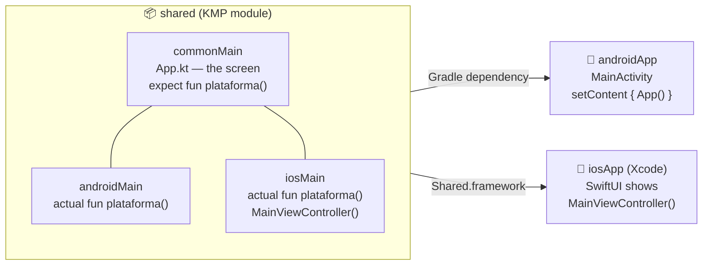

# HolaMundoKMP — your first Kotlin Multiplatform app

🇬🇧 **English** · 🇪🇸 [Español](README.es.md)

A **"Hello World!" written once in Kotlin** that runs on **Android** and **iOS**, with the UI built in
**Compose Multiplatform** (the same Jetpack Compose you know from Android, now on iPhone too).

This README is a **step-by-step tutorial for beginners**: it walks through every file in the project
in the order you would write it yourself, starting from an empty folder. **First you build it and run
it on Android**, **then you add iOS**.

> 🇪🇸 The app itself is in Spanish, and so are a few identifiers: **"¡Hola Mundo!"** = "Hello World!",
> **`plataforma()`** = `platform()`, **"Compose Multiplatform en Android 16"** = "… on Android 16".

| Android 16 (Pixel 9 emulator) | iOS 26.5 (iPhone 17 Pro simulator) |
|:---:|:---:|
|  |  |

Both screens come from **the same Kotlin function** (`App()`). The only thing that differs is the
second line, which says which system it is running on: that part is written by each platform on its own.

---

## Contents

- [Concepts in 3 minutes](#concepts-in-3-minutes)
- [What you need to install](#what-you-need-to-install)
- [If you just want to run it](#if-you-just-want-to-run-it)
- **[Part 1 — Android](#part-1--android)**
  - [1.1 The folder and the Gradle Wrapper](#11-the-folder-and-the-gradle-wrapper)
  - [1.2 `settings.gradle.kts`: the list of modules](#12-settingsgradlekts-the-list-of-modules)
  - [1.3 `gradle/libs.versions.toml`: all versions in one place](#13-gradlelibsversionstoml-all-versions-in-one-place)
  - [1.4 Root `build.gradle.kts` and `gradle.properties`](#14-root-buildgradlekts-and-gradleproperties)
  - [1.5 The `shared` module (Android only, for now)](#15-the-shared-module-android-only-for-now)
  - [1.6 The shared screen: `App.kt`](#16-the-shared-screen-appkt)
  - [1.7 `expect` / `actual`: what changes per platform](#17-expect--actual-what-changes-per-platform)
  - [1.8 The `androidApp` module](#18-the-androidapp-module)
  - [1.9 Open it in Android Studio](#19-open-it-in-android-studio)
  - [1.10 Create the emulator](#110-create-the-emulator)
  - [1.11 Run it on Android!](#111-run-it-on-android)
- **[Part 2 — iOS (Mac only)](#part-2--ios-mac-only)**
  - [2.1 Before you start](#21-before-you-start)
  - [2.2 Add the iOS targets to `shared`](#22-add-the-ios-targets-to-shared)
  - [2.3 The `iosMain` code](#23-the-iosmain-code)
  - [2.4 Check that the iOS Kotlin compiles](#24-check-that-the-ios-kotlin-compiles)
  - [2.5 The Xcode project (`iosApp/`)](#25-the-xcode-project-iosapp)
  - [2.6 Run it on the iOS simulator!](#26-run-it-on-the-ios-simulator)
  - [2.7 On a real iPhone](#27-on-a-real-iphone)
- [Part 3 — What's next?](#part-3--whats-next)
- [Troubleshooting](#troubleshooting)
- [Versions used](#versions-used)

---

## Concepts in 3 minutes

**Kotlin Multiplatform (KMP)** lets you write Kotlin code **once** and compile it for several
platforms: to JVM bytecode for Android and to native code (Kotlin/Native) for iOS.

**Compose Multiplatform (CMP)** goes one step further: besides the logic, it shares the **UI**. If
you know Jetpack Compose, you already know CMP: `@Composable`, `Column`, `Text`, `MaterialTheme`… are
the same, with the same `import androidx.compose.*`.

The project has **three pieces**:



- **`shared`** is where almost everything lives. Inside it there are *source sets* (code folders):
  - `commonMain`: code that compiles for **every** platform. You can't use anything that only exists
    on Android (`android.*`) or on iOS (`platform.UIKit.*`) here.
  - `androidMain`: code compiled **only** for Android. Here you can use `android.*`.
  - `iosMain`: code compiled **only** for iOS. Here you can use Apple's APIs
    (`platform.UIKit.*`, `platform.Foundation.*`…).
- **`androidApp`** is a plain, ordinary Android app. Its only job is to open an `Activity` and draw
  the screen from `shared`.
- **`iosApp`** is a plain, ordinary Xcode project (SwiftUI). Its only job is to open a window and put
  the screen from `shared` inside it.

---

## What you need to install

| For… | You need | System |
|---|---|---|
| Android | **Android Studio** (it ships the Android SDK, the emulator and a JDK) | Windows, Mac or Linux |
| iOS | All of the above **+ Xcode** (from the App Store) | **Mac only** |

> 💡 **You don't need to install Java separately.** Android Studio ships its own JDK (called *JBR*).
> If you are going to run Gradle from a terminal, tell it where that JDK is:
>
> - **Mac:** `export JAVA_HOME="/Applications/Android Studio.app/Contents/jbr/Contents/Home"`
> - **Windows (PowerShell):** `$env:JAVA_HOME = "C:\Program Files\Android\Android Studio\jbr"`
>
> Inside Android Studio you don't need anything: it already uses it.

> 💡 **Apple Silicon Mac (M1, M2, M3…).** The iOS part is meant for Apple Silicon Macs. On an Intel
> Mac the iOS simulator would not work (see [Troubleshooting](#troubleshooting)).

---

## If you just want to run it

**1. Clone the repo.** With **GitHub Desktop**: *File → Clone repository…* → *URL* tab → paste the
repo address → pick a folder → *Clone*. Or from a terminal:

```bash
git clone <URL-of-this-repo>
```

**2. Android (Windows, Mac or Linux):** open the `HolaMundoKMP` folder in Android Studio → wait for
the *Gradle sync* to finish → pick `androidApp` and an emulator at the top → ▶. Details in
[1.9](#19-open-it-in-android-studio) to [1.11](#111-run-it-on-android).

**3. iOS (Mac only):** open `iosApp/iosApp.xcodeproj` in Xcode → pick an iPhone simulator → ▶.
Details in [2.6](#26-run-it-on-the-ios-simulator). For your own iPhone, see
[2.7](#27-on-a-real-iphone).

If you want to **learn how to build it yourself**, keep reading.

---

# Part 1 — Android

By the end of this part you will have "¡Hola Mundo!" running on the Android emulator. Everything
here works **the same on Windows, Mac and Linux**.

## 1.1 The folder and the Gradle Wrapper

Create an empty folder, for example `HolaMundoKMP`. Everything else goes inside it.

**Gradle** is the tool that builds the project. The **Gradle Wrapper** is 4 files that download and
always use the **same version** of Gradle, so the project builds the same way on any machine without
installing Gradle:

```
HolaMundoKMP/
├── gradlew                              ← script for Mac/Linux
├── gradlew.bat                          ← script for Windows
└── gradle/wrapper/
    ├── gradle-wrapper.jar
    └── gradle-wrapper.properties        ← says WHICH Gradle version to use
```

The easiest way to get them is to **copy them from any Android project** you already have (or from
this repo). If you have Gradle installed, you can also generate them with
`gradle wrapper --gradle-version 9.5.0`.

The important part is in `gradle/wrapper/gradle-wrapper.properties`:

```properties
distributionUrl=https\://services.gradle.org/distributions/gradle-9.5.0-bin.zip
```

## 1.2 `settings.gradle.kts`: the list of modules

This is the first thing Gradle reads. It says **what the project is called**, **where plugins and
libraries are downloaded from**, and **which modules** it has.

```kotlin
rootProject.name = "HolaMundoKMP"

pluginManagement {
    repositories {
        google {
            content {
                includeGroupByRegex("com\\.android.*")
                includeGroupByRegex("com\\.google.*")
                includeGroupByRegex("androidx.*")
            }
        }
        mavenCentral()
        gradlePluginPortal()
    }
}

plugins {
    // Downloads the JDK a toolchain asks for if the machine doesn't have it.
    id("org.gradle.toolchains.foojay-resolver-convention") version "1.0.0"
}

dependencyResolutionManagement {
    repositoriesMode.set(RepositoriesMode.FAIL_ON_PROJECT_REPOS)
    repositories {
        google()        // Google/AndroidX libraries
        mavenCentral()  // almost everything else (Kotlin, Compose Multiplatform…)
    }
}

include(":shared")
include(":androidApp")
```

Each `include(":x")` matches an `x/` folder with its own `build.gradle.kts`.

## 1.3 `gradle/libs.versions.toml`: all versions in one place

This is the **version catalog**. Instead of writing `"2.3.21"` in five different files, you write it
once here and the `build.gradle.kts` files use it as `libs.plugins.kotlin.multiplatform`,
`libs.androidx.activity.compose`, etc. (Dashes in the `.toml` become dots.)

```toml
[versions]
agp = "9.3.0"
kotlin = "2.3.21"
composeMultiplatform = "1.11.1"
composeMaterial3 = "1.9.0"      # Material 3 has its own version numbers
activityCompose = "1.12.4"
android-compileSdk = "36"
android-targetSdk = "36"
android-minSdk = "24"

[libraries]
androidx-activity-compose = { module = "androidx.activity:activity-compose", version.ref = "activityCompose" }
compose-runtime = { module = "org.jetbrains.compose.runtime:runtime", version.ref = "composeMultiplatform" }
compose-foundation = { module = "org.jetbrains.compose.foundation:foundation", version.ref = "composeMultiplatform" }
compose-ui = { module = "org.jetbrains.compose.ui:ui", version.ref = "composeMultiplatform" }
compose-material3 = { module = "org.jetbrains.compose.material3:material3", version.ref = "composeMaterial3" }

[plugins]
android-application = { id = "com.android.application", version.ref = "agp" }
android-kmp-library = { id = "com.android.kotlin.multiplatform.library", version.ref = "agp" }
kotlin-multiplatform = { id = "org.jetbrains.kotlin.multiplatform", version.ref = "kotlin" }
compose-multiplatform = { id = "org.jetbrains.compose", version.ref = "composeMultiplatform" }
kotlin-compose = { id = "org.jetbrains.kotlin.plugin.compose", version.ref = "kotlin" }
```

What each plugin does:

| Plugin | What it's for |
|---|---|
| `com.android.application` | Turns a module into an **Android app** (builds the APK). |
| `com.android.kotlin.multiplatform.library` | Adds the **Android target** to a KMP module. |
| `org.jetbrains.kotlin.multiplatform` | Turns a module into **KMP** (several targets, source sets). |
| `org.jetbrains.compose` | Brings in the Compose Multiplatform **libraries** (including the iOS builds). |
| `org.jetbrains.kotlin.plugin.compose` | The Compose **compiler**: without it, `@Composable` doesn't compile. |

> ⚠️ **Versions come in pairs.** The `kotlin-compose` plugin uses the same version as Kotlin, and each
> Compose Multiplatform release requires a minimum Kotlin version. If you bump one, check the others.

> 💡 In older tutorials you will see `implementation(compose.runtime)`, `compose.material3`, etc.
> Those plugin shortcuts **are deprecated** (Gradle warns: *"Specify dependency directly"*), which is
> why the Compose libraries are declared in the catalog here like any other library.

## 1.4 Root `build.gradle.kts` and `gradle.properties`

The root `build.gradle.kts` only **declares** the plugins (`apply false` = "keep them at hand, but
don't apply them here"). That way every module uses the same version:

```kotlin
plugins {
    alias(libs.plugins.android.application) apply false
    alias(libs.plugins.android.kmp.library) apply false
    alias(libs.plugins.kotlin.multiplatform) apply false
    alias(libs.plugins.compose.multiplatform) apply false
    alias(libs.plugins.kotlin.compose) apply false
}
```

`gradle.properties` holds Gradle settings:

```properties
org.gradle.jvmargs=-Xmx4096m -Dfile.encoding=UTF-8   # 4 GB of memory for Gradle
org.gradle.caching=true                               # reuse results from earlier builds

kotlin.code.style=official

android.useAndroidX=true
android.nonTransitiveRClass=true
```

> 💡 You'll also see `gradle/gradle-daemon-jvm.properties`. **You don't write it by hand**: Android
> Studio generates it, and it says which JDK Gradle runs on (here **25**, the same one bundled with
> Android Studio 2026.x). If a machine doesn't have it, Gradle downloads it by itself the first time.

## 1.5 The `shared` module (Android only, for now)

Create the `shared/` folder with this `shared/build.gradle.kts`. **For now it only has the Android
target**; iOS gets added in [Part 2](#22-add-the-ios-targets-to-shared).

```kotlin
import org.jetbrains.kotlin.gradle.dsl.JvmTarget

plugins {
    alias(libs.plugins.kotlin.multiplatform)
    alias(libs.plugins.android.kmp.library)
    alias(libs.plugins.compose.multiplatform)
    alias(libs.plugins.kotlin.compose)
}

kotlin {
    android {
        namespace = "ovh.gabrielhuav.holamundo.shared"
        compileSdk = libs.versions.android.compileSdk.get().toInt()
        minSdk = libs.versions.android.minSdk.get().toInt()

        compilerOptions {
            jvmTarget.set(JvmTarget.JVM_11)
        }
    }

    // (The iOS targets go here in Part 2)

    sourceSets {
        commonMain.dependencies {
            implementation(libs.compose.runtime)
            implementation(libs.compose.foundation)
            implementation(libs.compose.ui)
            implementation(libs.compose.material3)
        }
    }
}
```

Notice that the Compose dependencies go in **`commonMain`**: that's what lets shared code use them.
On Android, the plugin automatically swaps them for the usual `androidx.compose.*` artifacts, so the
Android app uses the same Compose as always.

Then create the code folders (the package can be anything you like):

```
shared/src/
├── commonMain/kotlin/ovh/gabrielhuav/holamundo/
│   ├── App.kt
│   └── Plataforma.kt
└── androidMain/kotlin/ovh/gabrielhuav/holamundo/
    └── Plataforma.android.kt
```

## 1.6 The shared screen: `App.kt`

`shared/src/commonMain/kotlin/ovh/gabrielhuav/holamundo/App.kt`. It's plain, ordinary Compose:

```kotlin
package ovh.gabrielhuav.holamundo

import androidx.compose.foundation.layout.Arrangement
import androidx.compose.foundation.layout.Column
import androidx.compose.foundation.layout.fillMaxSize
import androidx.compose.material3.MaterialTheme
import androidx.compose.material3.Surface
import androidx.compose.material3.Text
import androidx.compose.runtime.Composable
import androidx.compose.ui.Alignment
import androidx.compose.ui.Modifier

@Composable
fun App() {
    MaterialTheme {                                   // Material 3 colors and typography
        Surface(modifier = Modifier.fillMaxSize()) {  // a background that fills the screen
            Column(                                   // stacks its children vertically…
                modifier = Modifier.fillMaxSize(),
                verticalArrangement = Arrangement.Center,           // …centered vertically
                horizontalAlignment = Alignment.CenterHorizontally, // …and horizontally
            ) {
                Text(
                    text = "¡Hola Mundo!",
                    style = MaterialTheme.typography.displayMedium,
                    color = MaterialTheme.colorScheme.primary,
                )
                Text(
                    text = "Compose Multiplatform en ${plataforma()}",
                    style = MaterialTheme.typography.titleMedium,
                )
            }
        }
    }
}
```

This is the function that **both** platforms will show.

## 1.7 `expect` / `actual`: what changes per platform

`App()` wants to show "Android 16" or "iOS 26.5". But asking for the system version **can't be done
the same way** on both: on Android it's `Build.VERSION.RELEASE` and on iOS it's `UIDevice`. And
neither can be used in `commonMain`.

KMP's answer is **`expect` / `actual`**:

- In `commonMain` you **declare** the function with `expect` (no body): "this will exist".
- On each platform you **implement** it with `actual`.

`shared/src/commonMain/kotlin/ovh/gabrielhuav/holamundo/Plataforma.kt`:

```kotlin
package ovh.gabrielhuav.holamundo

/** System name and version, e.g. "Android 16" or "iOS 26.5". Each platform provides its `actual`. */
expect fun plataforma(): String
```

`shared/src/androidMain/kotlin/ovh/gabrielhuav/holamundo/Plataforma.android.kt`:

```kotlin
package ovh.gabrielhuav.holamundo

import android.os.Build

actual fun plataforma(): String = "Android ${Build.VERSION.RELEASE}"
```

> 💡 The `expect` and the `actual`s must be in the **same package** and have the **same signature**.
> If a platform is missing its `actual`, the project doesn't compile and the error tells you which one.

## 1.8 The `androidApp` module

This is the Android app that gets installed on the phone. Create `androidApp/build.gradle.kts`:

```kotlin
import org.jetbrains.kotlin.gradle.dsl.JvmTarget

plugins {
    // AGP 9 has Kotlin built in: do NOT apply `org.jetbrains.kotlin.android`.
    alias(libs.plugins.android.application)
    alias(libs.plugins.kotlin.compose)
}

android {
    namespace = "ovh.gabrielhuav.holamundo"
    compileSdk = libs.versions.android.compileSdk.get().toInt()

    defaultConfig {
        applicationId = "ovh.gabrielhuav.holamundo"   // the app's unique identifier
        minSdk = libs.versions.android.minSdk.get().toInt()
        targetSdk = libs.versions.android.targetSdk.get().toInt()
        versionCode = 1
        versionName = "1.0"
    }

    compileOptions {
        sourceCompatibility = JavaVersion.VERSION_11
        targetCompatibility = JavaVersion.VERSION_11
    }

    buildFeatures {
        compose = true
    }
}

kotlin {
    compilerOptions {
        jvmTarget.set(JvmTarget.JVM_11)
    }
}

dependencies {
    implementation(project(":shared"))               // ← this is where the shared code plugs in
    implementation(libs.androidx.activity.compose)   // provides setContent { }
}
```

`androidApp/src/main/AndroidManifest.xml` — declares the `Activity` that opens when you tap the icon:

```xml
<?xml version="1.0" encoding="utf-8"?>
<manifest xmlns:android="http://schemas.android.com/apk/res/android">

    <application
        android:allowBackup="true"
        android:label="Hola Mundo KMP"
        android:supportsRtl="true"
        android:theme="@android:style/Theme.Material.Light.NoActionBar">
        <activity
            android:name=".MainActivity"
            android:exported="true">
            <intent-filter>
                <action android:name="android.intent.action.MAIN" />
                <category android:name="android.intent.category.LAUNCHER" />
            </intent-filter>
        </activity>
    </application>

</manifest>
```

`androidApp/src/main/kotlin/ovh/gabrielhuav/holamundo/MainActivity.kt` — **all Android does is call
`App()`**:

```kotlin
package ovh.gabrielhuav.holamundo

import android.os.Bundle
import androidx.activity.ComponentActivity
import androidx.activity.compose.setContent
import androidx.activity.enableEdgeToEdge

class MainActivity : ComponentActivity() {
    override fun onCreate(savedInstanceState: Bundle?) {
        enableEdgeToEdge()
        super.onCreate(savedInstanceState)
        setContent { App() }   // the screen from `shared`
    }
}
```

## 1.9 Open it in Android Studio

1. Android Studio → **File → Open…** → choose the **`HolaMundoKMP`** folder (the root, not `androidApp`).
2. If it asks **"Trust and Open Project?"**, click **Trust Project** (it's your own project).
3. At the bottom you'll see **Gradle sync** working. The first time it downloads Gradle, the plugins
   and the libraries: it can take **several minutes** (it took 3 minutes here). Wait until it
   finishes without errors.
4. Android Studio creates a `local.properties` file with the path to your Android SDK. It's specific
   to each machine and **is not committed to git** (it's already in `.gitignore`).

To see the structure as in this tutorial, switch the left panel from the *Android* view to
**Project**. This is the project, with the three `shared` *source sets* and `App.kt` open; at the top
right, the emulator (`Pixel 9 API 36`) and the `androidApp` run configuration:


## 1.10 Create the emulator

If you already have an emulator, skip this step: **one is enough** for all your projects.

1. **Tools → Device Manager** (or the phone icon on the right-hand bar).
2. The **+** button → **Create Virtual Device**.
3. Pick a phone, for example **Pixel 9**, and **Next**.
4. Pick the **API 36 ("Baklava", Android 16)** system image. If it has a download arrow ⬇, click it
   (~2 GB). Which variant:
   - Windows/Linux PC (Intel or AMD) → the **x86_64** one.
   - Apple Silicon Mac → the **arm64-v8a** one.
5. **Finish**. You end up with this (the green dot means it's running):


> 🧹 **Duplicate emulators?** In the Device Manager, each one's **⋮** menu has **Delete**. Every
> emulator takes several GB of disk, so it's best not to pile them up.

## 1.11 Run it on Android!

In Android Studio's top bar pick the **`androidApp`** configuration and your emulator, then click
**▶ Run**. The emulator starts (the first time takes a while) and you get:


The same from a terminal, with the emulator already open:

```bash
./gradlew :androidApp:installDebug
```

(On Windows: `gradlew.bat :androidApp:installDebug`.) That builds and installs the app on the
emulator; then open it from the app drawer ("Hola Mundo KMP").

> 💡 With only the Android target, Gradle shows the warning **`⚠️ Unused Kotlin Source Sets … commonTest`**.
> It's harmless (there are no tests yet) and **goes away by itself in Part 2**, once the iOS targets are added.

🎉 **Part 1 done:** you have an Android app whose screen lives in a multiplatform module. Now let's
make that same code run on iPhone.

---

# Part 2 — iOS (Mac only)

> ⚠️ Building and running the iOS app **requires a Mac with Xcode**. That's Apple's requirement, not
> Kotlin's. On Windows you can keep working on the Android side without any problem.

## 2.1 Before you start

- Install **Xcode** from the App Store and open it once so it finishes installing its components.
- In Xcode → **Settings → Components**, make sure an **iOS** platform (simulator) is installed.
- Keep the `JAVA_HOME` from [What you need to install](#what-you-need-to-install) at hand if you'll
  use the terminal.

## 2.2 Add the iOS targets to `shared`

In `shared/build.gradle.kts`, where we left the `(The iOS targets go here…)` comment, add:

```kotlin
    // Apple Silicon only: `iosX64` (simulator on Intel Macs) is no longer published by Compose 1.11.
    listOf(
        iosArm64(),          // real iPhone
        iosSimulatorArm64(), // simulator on an Apple Silicon Mac
    ).forEach { target ->
        target.binaries.framework {
            // Swift imports it as `import Shared`.
            baseName = "Shared"
            isStatic = true
        }
    }
```

What each part means:

- **`iosArm64()`** builds for a **real iPhone**; **`iosSimulatorArm64()`** for the **simulator** on an
  Apple Silicon Mac. They are different binaries.
- **`binaries.framework`** tells Kotlin to package the code as an **Apple framework**
  (`Shared.framework`), which is what Xcode knows how to import.
- **`isStatic = true`**: the framework gets linked into the app's executable, so it doesn't have to be
  signed or copied separately.

Adding these targets makes Kotlin create the **`iosMain`** source set, shared by both.

## 2.3 The `iosMain` code

Since `plataforma()` is an `expect`, **it now needs an iOS `actual`** (if you try to build for iOS
without it, it fails, and that's exactly what we want: KMP won't let you forget a platform).

`shared/src/iosMain/kotlin/ovh/gabrielhuav/holamundo/Plataforma.ios.kt`:

```kotlin
package ovh.gabrielhuav.holamundo

import platform.UIKit.UIDevice   // ← an Apple API, called from Kotlin

actual fun plataforma(): String =
    "${UIDevice.currentDevice.systemName()} ${UIDevice.currentDevice.systemVersion}"
```

And the "plug" Swift will use, `shared/src/iosMain/kotlin/ovh/gabrielhuav/holamundo/MainViewController.kt`:

```kotlin
package ovh.gabrielhuav.holamundo

import androidx.compose.ui.window.ComposeUIViewController

fun MainViewController() = ComposeUIViewController { App() }
```

`ComposeUIViewController` wraps any `@Composable` in a `UIViewController`, which is UIKit's
"screen". It's the iOS equivalent of Android's `setContent { }`.

## 2.4 Check that the iOS Kotlin compiles

Before touching Xcode, confirm that Kotlin compiles for the simulator:

```bash
./gradlew :shared:linkDebugFrameworkIosSimulatorArm64
```

The first run takes a while (it downloads the Kotlin/Native compiler). If it ends in
`BUILD SUCCESSFUL`, the framework is in `shared/build/bin/iosSimulatorArm64/debugFramework/Shared.framework`.

> 💡 You don't need to run this command every time: in the next step Xcode does it for you. It's only
> to catch Kotlin errors before wrestling with Xcode.

## 2.5 The Xcode project (`iosApp/`)

This repo already includes the project (`iosApp/iosApp.xcodeproj`). If you want to set it up yourself
from scratch, these are the steps, and they are exactly the settings the repo's project has:

**a) Create the project.** Xcode → **File → New → Project… → iOS → App**.
- *Product Name*: `iosApp` · *Interface*: **SwiftUI** · *Language*: **Swift**.
- Save it **inside `HolaMundoKMP/`**. You'll end up with `HolaMundoKMP/iosApp/iosApp.xcodeproj` and the
  Swift code in `HolaMundoKMP/iosApp/iosApp/`.

**b) A phase that compiles the Kotlin.** In the left navigator click the **iosApp** project (blue
icon) → **iosApp** target → **Build Phases** tab → **+ → New Run Script Phase**. Rename it to
`Compile Kotlin Framework`, **drag it above "Compile Sources"** and paste:

```sh
if [ "YES" = "$OVERRIDE_KOTLIN_BUILD_IDE_SUPPORTED" ]; then
  echo "OVERRIDE_KOTLIN_BUILD_IDE_SUPPORTED=YES: skipping Gradle"
  exit 0
fi
# Xcode does NOT inherit the terminal's JAVA_HOME. If there isn't one, use the JDK shipped with Android Studio.
if [ -z "$JAVA_HOME" ]; then
  JBR="/Applications/Android Studio.app/Contents/jbr/Contents/Home"
  if [ -d "$JBR" ]; then export JAVA_HOME="$JBR"; fi
fi
cd "$SRCROOT/.."
./gradlew :shared:embedAndSignAppleFrameworkForXcode
```

This is how it looks in Xcode (note the order: *Compile Kotlin Framework* comes **before**
*Compile Sources*):


The `embedAndSignAppleFrameworkForXcode` task comes with the Kotlin plugin: it reads from Xcode
whether you're building for the simulator or an iPhone, Debug or Release, and compiles **exactly**
the framework that's needed.

**c) Three *Build Settings*** (iosApp target; use the search box at the top right):

| Setting | Value | Why |
|---|---|---|
| **Framework Search Paths** | `$(SRCROOT)/../shared/build/xcode-frameworks/$(CONFIGURATION)/$(SDK_NAME)` | That's where the phase above leaves the framework. |
| **Other Linker Flags** | `-framework Shared` | Links `Shared.framework` into the app. |
| **User Script Sandboxing** | `No` | Otherwise Xcode won't let the Gradle phase write into `shared/build`. |

**d) The `Info.plist`.** Compose Multiplatform **closes the app on launch** if `Info.plist` doesn't
have the `CADisableMinimumFrameDurationOnPhone = YES` key, and the `Info.plist` Xcode generates
doesn't include it. Use this repo's [`iosApp/Info.plist`](iosApp/Info.plist) (it lives **outside**
the `iosApp/iosApp/` folder so Xcode doesn't try to copy it as a resource) and in *Build Settings*
set **Info.plist File** = `Info.plist` and **Generate Info.plist File** = `No`.

With the **Customized** and **Combined** filters in *Build Settings* you only see what you changed.
The settings from **c)** and **d)** are all there (Xcode shows *Framework Search Paths* already
resolved, with the full path):


**e) The Swift code.** Replace the contents of the two files Xcode created.

`iosApp/iosApp/iOSApp.swift` (the entry point):

```swift
import SwiftUI

@main
struct iOSApp: App {
    var body: some Scene {
        WindowGroup {
            ContentView()
        }
    }
}
```

`iosApp/iosApp/ContentView.swift` — the bridge between SwiftUI and Compose:

```swift
import SwiftUI
import UIKit
import Shared   // ← the Kotlin framework

struct ComposeView: UIViewControllerRepresentable {
    func makeUIViewController(context: Context) -> UIViewController {
        MainViewControllerKt.MainViewController()   // the function from MainViewController.kt
    }

    func updateUIViewController(_ uiViewController: UIViewController, context: Context) {}
}

struct ContentView: View {
    var body: some View {
        ComposeView()
            .ignoresSafeArea()   // let Compose fill the whole screen
    }
}
```

> 💡 **Why `MainViewControllerKt`?** Kotlin puts top-level functions (the ones outside any class)
> into a class named after the file + `Kt`. `MainViewController.kt` → `MainViewControllerKt`.

## 2.6 Run it on the iOS simulator!

1. Open **`iosApp/iosApp.xcodeproj`** in Xcode.
2. At the top, pick the **iosApp** scheme and a simulator, for example **iPhone 17 Pro**.
3. Click **▶ Run** (⌘R).

The first build takes a bit longer because the *Compile Kotlin Framework* phase compiles the Kotlin.
When the top bar says **"Running iosApp on iPhone 17 Pro"**, you're done:


And on the simulator:


**It's the same `App()` function you saw on Android.** 🎉

From a terminal (with a simulator already booted):

```bash
xcodebuild -project iosApp/iosApp.xcodeproj -scheme iosApp -configuration Debug -destination 'platform=iOS Simulator,name=iPhone 17 Pro' -derivedDataPath build/ios build
```

```bash
xcrun simctl install booted build/ios/Build/Products/Debug-iphonesimulator/iosApp.app
```

```bash
xcrun simctl launch booted ovh.gabrielhuav.holamundo
```

## 2.7 On a real iPhone

**Short answer:** just like Android has *Developer options*, the iPhone has **Developer Mode**, and you
have to turn it on. On top of that, Xcode has to **sign** the app with your Apple ID. A **free Apple ID
is enough**.

| | Android | iPhone |
|---|---|---|
| Development mode | *Developer options* (tap "Build number" 7 times) | **Developer Mode** (Settings → Privacy & Security) |
| When you plug in the cable | "Allow USB debugging?" | **"Trust This Computer?"** |
| Signing | Automatic (debug key) | With your **Apple ID** (*Personal Team*) |
| First time you open the app | It just opens | You have to **trust** your certificate (step 8) |

**You need:** an iPhone on **iOS 16 or later**, its cable and an Apple ID. The iPhone's iOS version
can't be **newer** than what your Xcode supports; if it is, update Xcode.

Steps (first time only):

1. **Add your Apple ID to Xcode:** Xcode → **Settings… → Accounts** → **+** → *Apple Account*.
2. **Choose who signs:** **iosApp** project → **iosApp** target → **Signing & Capabilities** tab →
   check **Automatically manage signing** → **Team**: *"Your Name (Personal Team)"*.
3. **A unique Bundle Identifier.** If you cloned someone else's repo, change `ovh.gabrielhuav.holamundo`
   to one of your own (e.g. `com.yourname.holamundo`): each identifier can only belong to one account.
4. **Plug the iPhone in with the cable** and unlock it. Tap **Trust** on *"Trust This Computer?"* and
   enter your passcode.
5. **Turn on Developer Mode** on the iPhone: **Settings → Privacy & Security → Developer Mode** →
   turn it on → **Restart**. After it restarts, unlock it and confirm **Turn On**.
   > The option **only shows up after the iPhone has been connected to a Mac with Xcode**. If you
   > don't see it, plug it in, wait for Xcode to detect it and look again.
6. In Xcode, at the top, pick **your iPhone** as the destination (instead of the simulator). The first
   time, Xcode prepares it (*Preparing iPhone…*), which can take several minutes.
7. **▶ Run.** Nothing changes on the Kotlin side: the Gradle phase detects it's an iPhone and compiles
   `iosArm64` instead of the simulator. The first time takes longer (about 2 minutes here).
8. **Trust your certificate** (free accounts only): the first time, the app won't open and the iPhone
   says *"Untrusted Developer"*. Go to **Settings → General → VPN & Device Management** → under
   *Developer App* tap your Apple ID → **Trust**. Open the app again.

**Free account limits:** the app **expires after 7 days** (hit ▶ in Xcode again to renew it) and you
can have at most **3 of your own apps** installed at a time. The paid account (USD 99/year) lasts a
year and is the one that allows TestFlight and the App Store.

> 💡 **Wireless:** after the first time, in Xcode → **Window → Devices and Simulators** select your
> iPhone and check **Connect via network**. With the iPhone and the Mac on the same Wi-Fi, you can
> hit ▶ without the cable.

---

# Part 3 — What's next?

**Make a change and see it on both platforms.** Change the text in `App.kt`, hit ▶ in Android Studio
and ▶ in Xcode: you'll see the change on both without touching Swift or the `Activity`.

**Where does each thing go?**

| If your code… | …it goes in |
|---|---|
| Is logic or UI and doesn't need anything from the system | `shared/src/commonMain` |
| Needs Android APIs (`Context`, `Build`, sensors…) | `shared/src/androidMain` (with `expect`/`actual`) |
| Needs Apple APIs (`UIDevice`, `NSUserDefaults`…) | `shared/src/iosMain` (with `expect`/`actual`) |
| Is Android app configuration (permissions, icon…) | `androidApp/` |
| Is iOS app configuration (signing, icon, `Info.plist`…) | `iosApp/` |

**First exercise: a counter.** Add state to `App()` and check that it works the same on both systems:

```kotlin
// extra imports: androidx.compose.material3.Button, androidx.compose.runtime.*
var taps by remember { mutableStateOf(0) }
Button(onClick = { taps++ }) {
    Text("You tapped me $taps times")
}
```

**Recommended next steps:**
- Shared resources (images, translated strings) with `compose.components.resources`.
- Multiplatform libraries: [Ktor](https://ktor.io) (networking), `kotlinx.serialization` (JSON),
  `kotlinx.coroutines`, Room (database).
- The official docs: <https://www.jetbrains.com/help/kotlin-multiplatform-dev/>.

---

## Troubleshooting

**Gradle and Android Studio**

| Symptom | Cause and fix |
|---|---|
| `Unable to locate a Java Runtime` when running `./gradlew` | There's no `JAVA_HOME`. Use Android Studio's JDK (see [What you need to install](#what-you-need-to-install)). |
| `WARNING: Use --enable-native-access=ALL-UNNAMED…` when Gradle starts | A warning from the JDK 25 that ships with Android Studio, not from the project. Safe to ignore. |
| Android Studio suggests *"Project update recommended: Android Gradle plugin 9.3.0 has an upgrade available"* | Optional. **Don't run the assistant blindly:** AGP, Kotlin and Compose come in pairs (see [1.3](#13-gradlelibsversionstoml-all-versions-in-one-place)) and this project is tested with the [versions used](#versions-used). |
| Android Studio warns *"Project in Protected Folder"* (Mac) | The project is in `Documents`, `Desktop` or `Downloads`, which macOS protects. It works anyway; if you hit permission problems, move it to another folder (e.g. `~/AndroidStudioProjects`). |
| `Expected plataforma has no actual declaration in module <commonMain> for Native` | A platform is missing its `actual` (*Native* = iOS; if it says *JVM*, it's Android). Every `expect` needs an `actual` in `androidMain` **and** in `iosMain`. |
| Gradle: `Unresolved platforms: [iosX64]` | You declared `iosX64()`. Compose Multiplatform 1.11 no longer publishes it; remove it (it was only for the simulator on Intel Macs). |
| Error when applying `org.jetbrains.kotlin.android` | With AGP 9 it **isn't applied**: Kotlin is already built into the Android plugin. |
| Error when using `com.android.library` in `shared` | Since AGP 9, a KMP module uses `com.android.kotlin.multiplatform.library`. |
| On Windows you see warnings about the iOS targets | Expected: the iOS app can only be built on a Mac. The Android side works the same. |
| The Android emulator won't start on an Apple Silicon Mac | Use an **arm64-v8a** image; x86_64 images are for Intel/AMD PCs. |

**Xcode and iPhone**

| Symptom | Cause and fix |
|---|---|
| Xcode: `No such module 'Shared'` | The *Compile Kotlin Framework* phase didn't run or failed. Check its log in the *Report Navigator* (⌘9); it's usually a Kotlin or `JAVA_HOME` error. Also check that the phase comes **before** *Compile Sources*. |
| Xcode: `Sandbox: … deny(1) file-write-create` | **User Script Sandboxing = No** is missing ([2.5 c](#25-the-xcode-project-iosapp)). |
| The iOS app **closes right after opening**, with no clear error | `CADisableMinimumFrameDurationOnPhone` is missing from `Info.plist` ([2.5 d](#25-the-xcode-project-iosapp)). |
| Xcode warning `…was built for newer 'iOS-simulator' version (18.5) than being linked (16.0)` | Harmless: it comes from a library inside Compose. The app works the same. |
| In Xcode's console: `Failed to send CA Event for app launch measurements…` | Simulator noise when the app launches. Harmless. |
| Xcode: *"Developer Mode disabled"* / won't run on the iPhone | Turn on Developer Mode ([2.7](#27-on-a-real-iphone), step 5). |
| The app installs on the iPhone but won't open: *"Untrusted Developer"* | Trust your certificate ([2.7](#27-on-a-real-iphone), step 8). |
| Xcode: *"Failed Registering Bundle Identifier"* / *"…is not available"* | That identifier already belongs to another account. Change the *Bundle Identifier* to one of your own ([2.7](#27-on-a-real-iphone), step 3). |
| Xcode doesn't see the iPhone, or says its iOS version isn't supported | Unlock it and accept *"Trust This Computer?"*. If its iOS is newer than your Xcode, update Xcode. |

---

## Versions used

Verified on **2026-10-04** on an Apple Silicon Mac:

- **Android:** *Gradle sync* and ▶ Run from Android Studio on the Pixel 9 emulator (Android 16).
- **iOS:** ▶ Run from Xcode on the iPhone 17 Pro simulator (iOS 26.5), and a build for a real iPhone
  (`iosArm64`). Only signing is left, which depends on your Apple ID ([2.7](#27-on-a-real-iphone)).

| Piece | Version |
|---|---|
| Kotlin | 2.3.21 |
| Android Gradle Plugin (AGP) | 9.3.0 |
| Compose Multiplatform | 1.11.1 (Material 3: 1.9.0) |
| Gradle | 9.5.0 |
| Android | minSdk 24 · compileSdk / targetSdk 36 |
| iOS | 16.0 or later |
| Android Studio | 2026.2.1 (bundled JDK 25) |
| Xcode | 26.6 |

### Final structure

```
HolaMundoKMP/
├── settings.gradle.kts            modules and repositories
├── build.gradle.kts               plugins (not applied)
├── gradle.properties              Gradle settings
├── gradle/
│   ├── libs.versions.toml         version catalog
│   ├── gradle-daemon-jvm.properties  Gradle's JDK (generated by Android Studio)
│   └── wrapper/                   Gradle Wrapper
├── gradlew · gradlew.bat
├── shared/                        👉 the shared code
│   ├── build.gradle.kts
│   └── src/
│       ├── commonMain/…/App.kt, Plataforma.kt
│       ├── androidMain/…/Plataforma.android.kt
│       └── iosMain/…/Plataforma.ios.kt, MainViewController.kt
├── androidApp/                    🤖 the Android app
│   ├── build.gradle.kts
│   └── src/main/AndroidManifest.xml, …/MainActivity.kt
├── iosApp/                        🍏 the iOS app
│   ├── iosApp.xcodeproj
│   ├── Info.plist
│   └── iosApp/iOSApp.swift, ContentView.swift, Assets.xcassets
├── docs/capturas/                 the screenshots in this README
├── README.md                      this tutorial, in English
└── README.es.md                   this tutorial, in Spanish
```
